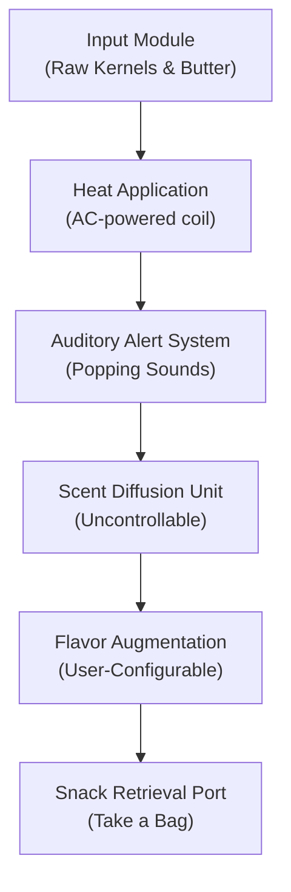

# 🍿Kernel-Panic-Snack-Deployer 9000  
**Real-Time Kernel Deployment System**

Welcome to the *Kernel-Panic-Snack-Deployer 9000*, the analog-based, user-interactive system for real-time corn kernel expansion and flavor distribution.

---

## 🏗️ System Architecture

---

## 🚀 Deployment Flow

1. Load kernel payload into hopper (approx. ½ cup).  
2. Engage heating coil until auditory alerts begin.  
3. Monitor scent emissions for optimal doneness.  
4. Deploy into containment unit (bag or bowl).  
5. Apply seasoning module (Butter.salt or Ranch.proto).  
6. Enjoy warm edible data structures.

---

## 🔥 Kernel Runtime Failure Mitigation

Common Exceptions:
- `OverheatException` → Burnt popcorn detected. Please CTRL+Z your life choices and reduce cook time.  
- `FlavorOverflowWarning` → Excessive flavor augmentation. Proceed only if you enjoy cheese fingers.  
- `UserInputError` → Lid not closed. Please RTFM (Read The Flavor Manual).

**Recovery Protocol:**
- Abort mission.  
- Remove burnt payload.  
- Vent room.  
- Deploy fresh kernel instance.

---

## 🛠️ Requirements

- One popcorn machine (analog or air-popper variant)  
- Power source  
- Kernels (non‑GMO encouraged)  
- Salt, butter, courage

---

## 📦 Optional Add-Ons

- USB Butter Sprayer (beta)  
- Cloud‑connected salt shaker (not recommended)  
- Raspberry Pi‑powered countdown timer with unnecessarily complex UI
